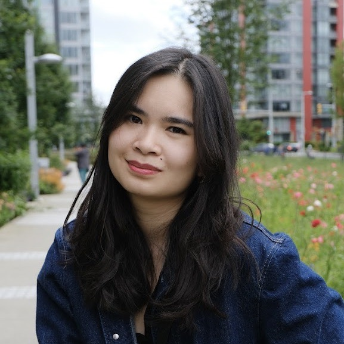

You can find my resume [here](resume.pdf)

- Master of Science in Computational Linguistics at the University of Washington, advised by [Shane Steinert-Threlkeld](https://www.shane.st/).

- BA in English at Sorbonne-Nouvelle Université (2019-2020)
- BSc in Computer Science at Sorbonne Université (previously: Université Pierre et Marie Curie) (2016-2019)
- BA in Philosophy at Sorbonne Université (2016-2019)

